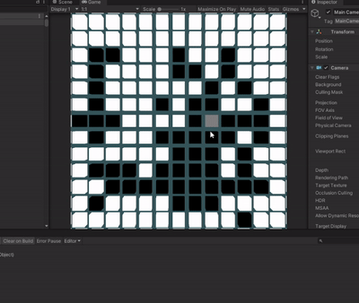

# GameOfLifeUnity

As a way of practicing my Unity skills I decided to implement Conways Game of Life in Unity 3D.

### The Board
The game board is made up of many instantiated cube primitives, these cubes resemble one cell of the game board.
There are 3 preset sizes (small : 10x10, medium: 30x30, and large: 50x50) any more than that many cubes on screen at once causes
frame rate issues. 

Here's a look at the blank board from a top down view at its largest size.

The user needs to be able to select the squares and turn them either on or off (alive or dead). I accomplished this via mouseclick
by sending out a ray and checking to see if that ray collided with the cell. I borrowed some of the code form my I3 Dev Test project
and added highlighting for when the cells are hovered over. You can see my initial attempt here.

It kind of works but in some cases when I click on a cell it doesnt change back to white and  requires multiple clicks to do so.
I fiddled around with the highlighting code and realized  it was an issue with the cell when it was being hovered over, I 
changed up the code to remember the cells original non_highlighted color and to reference that when toggling the color. Here's
the improved version in all it's glory.

